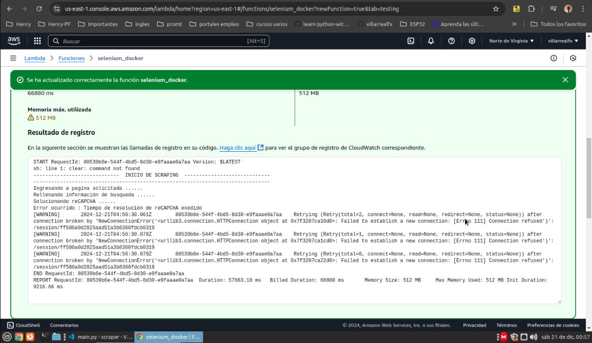
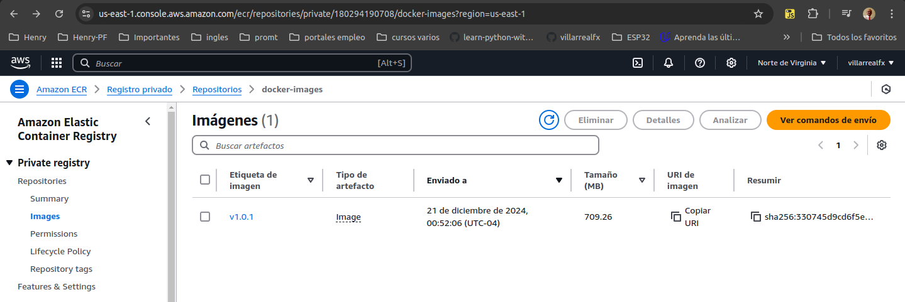
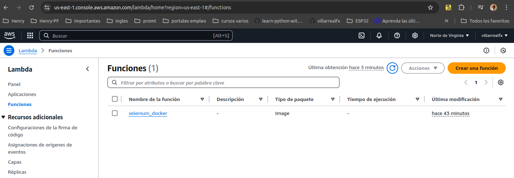

# Qanlex - Desarrollo de sistema de scraper web - Despliegue aws

## Introducción
**La tarea es desarrollar un scraper web para una página suministrada por la empresa con el objetivo es extraer información relevante sobre demandas presentes en el sitio. En el siguiente apartado se esta realizando un despliegue Selenium con ChromeDriver dentro de una función deAWS Lambda además al contenerizar la aplicación, garantizamos una arquitectura escalable y sin servidor.**

**Crearemos un contenedor Docker que incluya todas las dependencias necesarias para ejecutar Selenium y ChromeDriver. Este contenedor se implementará como una función AWS Lambda. La función Lambda realizará las tareas de scraping que hemos venido trabajando.**

## Prerrequisitos
* Una cuenta de AWS
* Una cuenta de GitHub
* Docker instalado
* AWS CLI configurado

## Los archivos 
* La aplicación está alojada en la carpeta aws y consta de los siguientes archivos:
    * **main.py**: Este script de Python es la función Lambda que usa Selenium para realizar la automatización del navegador.
    * **Archivo Dockerfile**: Este Dockerfile crea una imagen con todas las dependencias necesarias para ejecutar Selenium con ChromeDriver.
    * **chrome-installer.sh**: Este script instala las últimas versiones de Chrome y ChromeDriver.

## Procedimiento
* **Creación, etiquetado y envío de la imagen de Docker**

    * Construir la imagen de Docker debe de estar el la carpeta `aws`:
    ```bash
    docker build -t selenium-chrome-driver .
    ```
    * Tag la imagen de Docker:
    ```bash
    docker tag selenium-chrome-driver <id_de_aws>.dkr.ecr.us-east-1.amazonaws.com/docker-images:v1.0.0
    ```
    * Envíe la imagen de Docker a AWS ECR:
     ```awscli
    aws ecr get-login-password --region us-east-1 | docker login --username AWS --password-stdin <id_de_aws>.dkr.ecr.us-east-1.amazonaws.com/docker-images
    ```
     ```awscli
    docker push .dkr.ecr.us-east-1.amazonaws.com/docker-images:v1.0.0
    ```
    `docker build`: construye la imagen de Docker a partir del Dockerfile, 
`tag docker`: etiqueta la imagen con una versión específica en este caso v1.0.0, el comando àws ecr`envia el contenedor a AWS ECR y finalmente `docker push`: envía la imagen al repositorio de AWS ECR especificado.

    Después de enviar la imagen a AWS ECR, puede implementarla mediante AWS Lambda.

    * Imagenes


**Error corriendo script en AWS**


**Contenedor docker en AWS**


**Función lambda en AWS**

    


